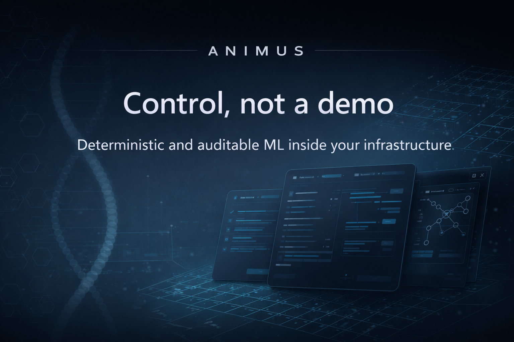

**Enterprise ML Control Plane**
Deterministic, auditable, reproducible machine learning — on‑prem and private cloud.

> **Control, not a demo.**
> Animus is a production‑grade ML DataLab designed to govern the full lifecycle of machine learning — from data to approved models — inside your infrastructure.

---

## Why Animus

Modern ML systems fail not because of models, but because of **loss of control**:

* datasets change silently;
* experiments cannot be reproduced;
* pipelines depend on hidden state;
* audit evidence is reconstructed manually.

Animus addresses this by acting as a **central control plane** for ML development — explicit, deterministic, and audit‑ready by design.

Animus does **not** execute user code and does **not** hide complexity behind magic. Everything that affects results is visible, versioned, and traceable.

---

## What Animus Is

Animus is a **corporate ML DataLab** that provides:

* a strict project boundary for ML work;
* explicit, immutable datasets and lineage;
* declarative pipelines and deterministic execution contracts;
* automatic history, audit, and evidence formation;
* governance primitives without slowing down developers.

Animus is built to be the **primary working environment for ML teams**, not a sidecar tool.

---

## What Animus Is Not

* ❌ Not a hosted SaaS
* ❌ Not a notebook platform
* ❌ Not a training runtime
* ❌ Not an experiment tracker bolted onto scripts

Animus assumes **on‑prem or private cloud**, sensitive data, and real production constraints.

---

## Core Concepts

Animus models ML work explicitly through first‑class entities:

* **Project** — strict isolation boundary for one ML product.
* **Dataset** — immutable, versioned data with schema, statistics, and lineage.
* **Pipeline** — declarative description of the ML process (what, not how).
* **Experiment** — a single, reproducible pipeline execution.
* **Model** — approved outcome of an experiment with lifecycle control.
* **Checks & Rules** — versioned quality and governance constraints.

Nothing exists implicitly. Nothing is reconstructed later.

---

## Architecture Overview

Animus is built around two independent planes.

### Control Plane

Responsible for:

* metadata and state management;
* orchestration and execution contracts;
* lineage, rules, and audit history.

The control plane **never executes user code**.

### Data Plane

Responsible for:

* pipeline execution;
* data processing and model training;
* artifact generation.

Execution is containerized and isolated. Kubernetes is the target runtime.

This separation ensures predictability, security, and scalability.

See: `docs/architecture.md`

---

## Deployment Model

* On‑prem or private cloud
* Air‑gapped friendly
* No dependency on public SaaS
* No external data flow

All services run **inside your network perimeter**.

---

## Guarantees

Animus provides the following guarantees by design:

* **Determinism**
  Every run is bound to explicit dataset versions, parameters, code commit, and environment.

* **Reproducibility**
  If a result cannot be reproduced, the system will state why.

* **Auditability**
  Append‑only history of actions, decisions, and artifacts.

* **Security**
  Project‑scoped access, RBAC, secret isolation, and controlled execution.

* **Operability**
  Idempotent APIs, explicit state transitions, exportable evidence.

---

## Quickstart (Open Demo)

> The open demo showcases control‑plane behavior only.
> It is **not** a hosted platform and **not** a production runtime.

### Requirements

* Go 1.22+
* Docker
* Docker Compose
* `curl` (preferred) or `python3`

### Run demo

```bash
make demo
```

### CI‑style smoke test

```bash
make demo-smoke
```

### No‑Docker smoke test

```bash
DEMO_NO_DOCKER=1 DEMO_BASE_URL=http://localhost:8080 make demo-smoke
```

### Expected output

```
==> starting demo stack
==> waiting for gateway http://localhost:8080/healthz
==> create project
==> create run
==> dry-run
==> userspace execution (data plane surface)
==> demo complete
```

Stop with `Ctrl+C`. For manual cleanup: `make demo-down`.

---

## Repository Structure

```
.
├── open/       # Schemas, SDKs, demo runner, open documentation
├── closed/     # Control plane services, migrations, UI, deployment assets
├── api/        # Execution and API schemas
├── docs/       # Architecture, execution model, ADRs
```

---

## Execution Model

Key execution contracts:

* **PipelineSpec** — declarative pipeline template.
* **RunSpec** — binds dataset version, code commit, and environment hash.
* **ExecutionPlan** — deterministic DAG derived from specs.
* **Dry‑run** — full simulation without user code execution.
* **Derived state** — computed from plan and step outcomes only.

See:

* `docs/execution.md`
* `docs/pipeline-spec.md`

---

## Documentation

* `docs/index.md`
* `docs/architecture.md`
* `docs/execution.md`
* `docs/demo.md`
* `docs/style.md`
* `docs/adr/README.md`

---

## Security

Animus is designed for sensitive data and regulated environments.

* SSO (OIDC / SAML)
* Project‑level RBAC
* Secret isolation
* Execution sandboxing
* Full security audit trail

For vulnerability reporting and coordinated disclosure, see `SECURITY.md`.

---

## Status

Animus is under active development.

This repository represents the **control plane foundation** of the platform.
