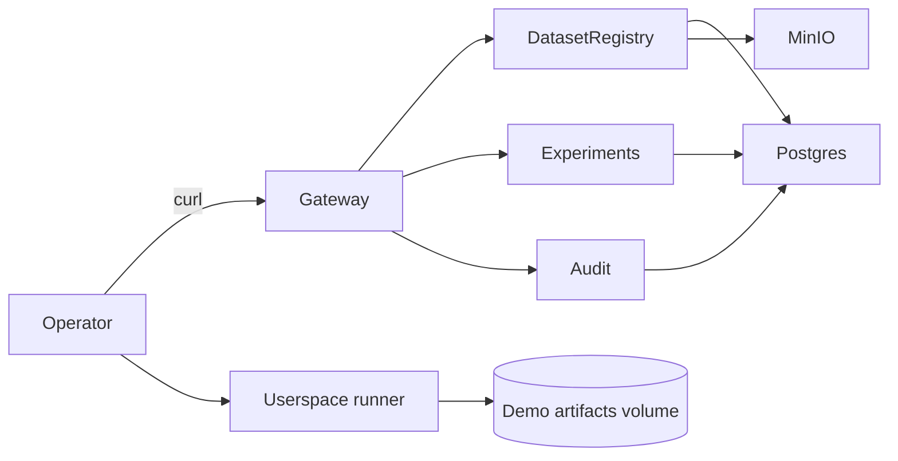

# Demo quickstart

Control, not a demo. This is a full-surface walkthrough that starts the closed control plane and a userspace runner (data plane surface).

## Scope
- Runs closed services locally via Docker Compose.
- Exercises project scoping, dataset registry, artifacts, runs, planning, dry-run, and audit export.
- Invokes a userspace runner container to simulate data plane execution.

## Quickstart

```bash
make demo
```

Smoke check:

```bash
make demo-smoke
```

No-docker smoke check (requires running services):

```bash
DEMO_NO_DOCKER=1 DEMO_BASE_URL=http://localhost:8080 make demo-smoke
```

Expected output includes:
- "==> starting demo stack"
- "==> create project"
- "==> create run"
- "==> dry-run"
- "==> userspace execution (data plane surface)"
- "==> demo complete"

## Requirements
- Go 1.22+
- Docker and docker compose (or docker-compose) for the full demo
- curl (preferred) or python3

## What is real today
- Control plane services and APIs (closed/).
- Deterministic planning and dry-run simulation.
- Audit export in NDJSON.
- Userspace runner container for safe, deterministic execution simulation.

## What is simulated
- Userspace runner executes a fixed allowlisted demo step and writes deterministic artifacts.
- Actual scheduled execution wiring is deferred to later phases.

## Separation (control plane vs data plane)



## Troubleshooting
- Port conflicts: set `ANIMUS_GATEWAY_PORT` or `ANIMUS_USERSPACE_PORT`.
- Docker not running: start Docker or Docker Desktop.
- Long startup: wait for migrations to complete.
- Missing curl: install curl or python3.
- Cleanup: `make demo-down`.
