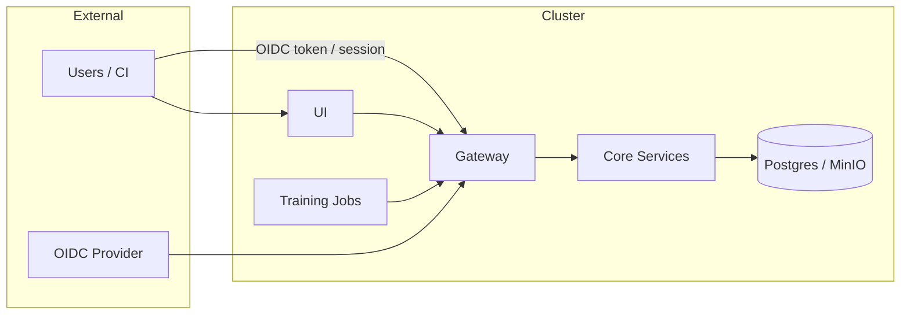

# Security and Compliance

This document describes the security model, compliance evidence, and hardening guidance for Animus DataPilot. The control-plane services are closed-source and are referenced here for integration context.

## Security model (authN/authZ)

- **Gateway-only access**: the gateway is the public entry point; services validate gateway-signed headers.
- **Auth modes**: `AUTH_MODE=oidc` (default), `dev`, or `disabled` (dev only).
- **RBAC**: role-based access enforced by the gateway and service boundaries.
- **Run tokens**: training/evaluation containers authenticate using run-scoped bearer tokens.

## Trust boundaries

### Service boundary enforcement

Services trust only gateway-signed headers:

- `X-Animus-Subject`
- `X-Animus-Email`
- `X-Animus-Roles`
- `X-Animus-Auth-Ts`
- `X-Animus-Auth-Sig`

Requests without a valid signature are rejected by services.

## RBAC matrix

| Role | Read APIs | Write APIs | Policy approvals |
| --- | --- | --- | --- |
| `viewer` | Yes | No | No |
| `editor` | Yes | Yes | No |
| `admin` | Yes | Yes | Yes (policy approvals) |

Gateway enforcement is method-based: `GET/HEAD/OPTIONS` require `viewer`; all other methods require `editor`. Policy approval endpoints require `admin` and are enforced in the closed-core services.

## Secrets and credentials

Required secrets (production):

- `ANIMUS_INTERNAL_AUTH_SECRET`: gateway -> service signing and run tokens.
- `ANIMUS_CI_WEBHOOK_SECRET`: CI webhook verification.
- `ANIMUS_EVIDENCE_SIGNING_SECRET`: evidence bundle signature (defaults to internal auth secret if unset).
- `ANIMUS_GITLAB_WEBHOOK_SECRET`: GitLab governance webhook verification (optional).
- `OIDC_CLIENT_SECRET`: OIDC login flow.
- `ANIMUS_MINIO_ACCESS_KEY` / `ANIMUS_MINIO_SECRET_KEY`: object storage access.

Store secrets in Kubernetes Secrets or an external secret manager; do not log or bake them into images. Rotate secrets with a coordinated deployment (gateway + services).

## Evidence and auditability

Animus DataPilot produces immutable evidence for compliance review:

- **Audit logs**: every write emits `audit_events` with a SHA256 integrity hash.
- **Lineage events**: dataset -> run -> git edges with integrity hashes.
- **Execution ledger**: canonical JSON entry per run with dataset hash, git, image digest, and policy decisions.
- **Evidence bundles**: signed ZIP containing ledger, lineage, audit slice, policies, and a PDF report.

Evidence bundle format and verification are described in [07-evidence-format.md](07-evidence-format.md).

## Threat model summary (STRIDE)

- **Spoofing**: mitigated by OIDC validation and gateway-signed headers.
- **Tampering**: immutable records + integrity hashes for audit/lineage; object storage uses content hashes.
- **Repudiation**: centralized audit log with `X-Request-Id` correlation.
- **Information disclosure**: RBAC at the gateway, service boundary auth, bucket separation.
- **Denial of service**: enforce ingress rate limits and request size limits; control training job quotas.
- **Elevation of privilege**: admin-only approvals and immutable policy versions.

## Hardening checklist

- Use `AUTH_MODE=oidc` and terminate TLS at ingress.
- Restrict network access so only gateway + UI are externally reachable.
- Enforce NetworkPolicies (default deny, explicit service-to-data access).
- Limit training job egress to the gateway endpoint.
- Set CPU/memory/GPU quotas for training workloads.

## Not implemented in this repository

- mTLS between services (recommend service mesh or mTLS-enabled ingress).
- Built-in rate limiting (use ingress/controller rate limits).
- Built-in metrics/tracing exporters (use sidecars or host-level collectors).

## Related docs

- [07-evidence-format.md](07-evidence-format.md)
- [04-operations.md](04-operations.md)
- [05-api.md](05-api.md)
