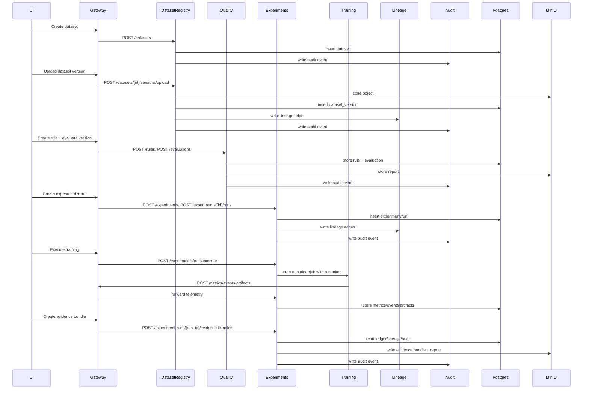

# Architecture

This document describes the system components, interfaces, and data flows for Animus DataPilot. Core services and the UI are closed-source and shown here for integration context.

## High-level system diagram

```mermaid
flowchart LR
  User[Users / CI] --> UI[UI (Next.js)]
  User --> Gateway[Gateway]
  UI --> Gateway
  Gateway --> DatasetRegistry[Dataset Registry]
  Gateway --> Quality[Quality]
  Gateway --> Experiments[Experiments]
  Gateway --> Lineage[Lineage]
  Gateway --> Audit[Audit]
  DatasetRegistry --> Postgres[(Postgres)]
  Quality --> Postgres
  Experiments --> Postgres
  Lineage --> Postgres
  Audit --> Postgres
  DatasetRegistry --> MinIO[(MinIO)]
  Quality --> MinIO
  Experiments --> MinIO
  Experiments --> Training[Training/Eval Jobs]
  Training --> Gateway
```

## Components

| Component | Responsibility | Interface | Default port | Dependencies |
| --- | --- | --- | --- | --- |
| UI | Control plane UI for datasets, experiments, lineage, audit | HTTP (Next.js) | 3000 | Gateway |
| Gateway | Auth, RBAC, audit correlation, reverse proxy | HTTP | 8080 | Postgres, services |
| Dataset Registry | Dataset metadata, immutable versions, downloads | HTTP | 8081 | Postgres, MinIO |
| Quality | Rule spec and evaluations | HTTP | 8082 | Postgres, MinIO |
| Experiments | Experiments, runs, training execution, evidence | HTTP | 8083 | Postgres, MinIO, Docker/K8s |
| Lineage | Lineage graph queries | HTTP | 8084 | Postgres |
| Audit | Audit log queries | HTTP | 8085 | Postgres |
| Postgres | Metadata storage and audit/lineage/event tables | TCP | 5432 | Persistent storage |
| MinIO | Dataset and artifact object storage | TCP/HTTP | 9000 | Persistent storage |

## Service interfaces

- Gateway exposes `/auth/*`, `/healthz`, `/readyz`, and `/api/*` routes.
- Services expose `/healthz`, `/readyz`, and their domain APIs (see `05-api.md`).
- Training/evaluation jobs call back to the gateway using run-scoped tokens.

## Data flow: dataset → run → code → image → evidence



## Closed-core libraries (not in this repo)

Core services share internal libraries for auth, policy enforcement, audit/lineage integrity, database access, and training execution. These are part of the closed-core implementation and are not distributed in this repository.

## Related docs

- `02-security-and-compliance.md`
- `03-deployment.md`
- `05-api.md`
- `07-evidence-format.md`
